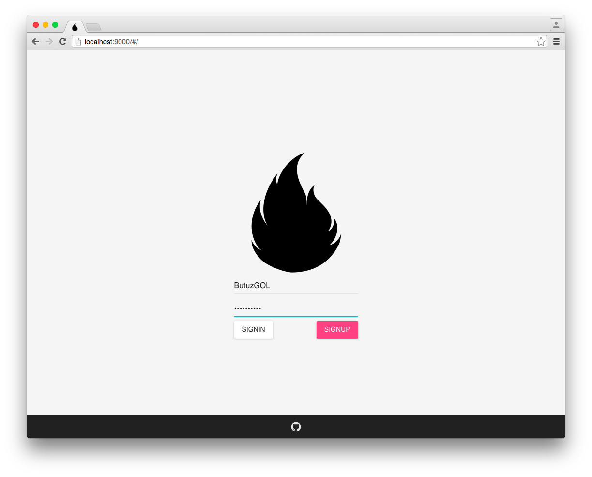
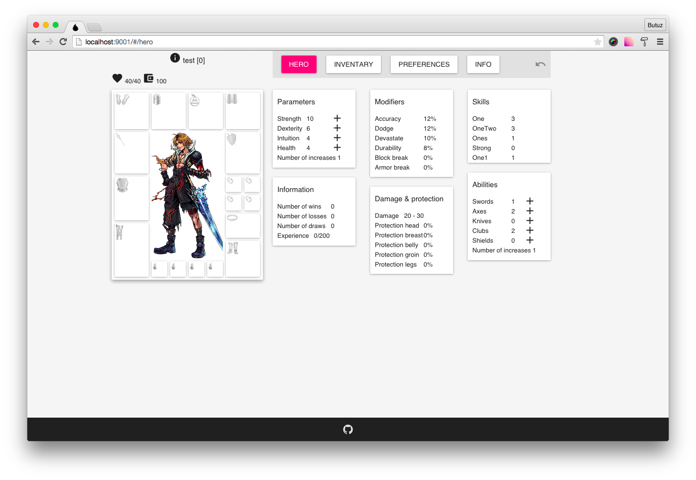
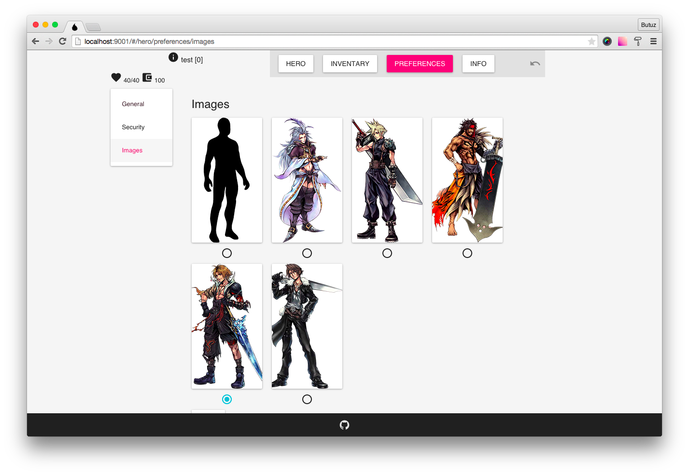
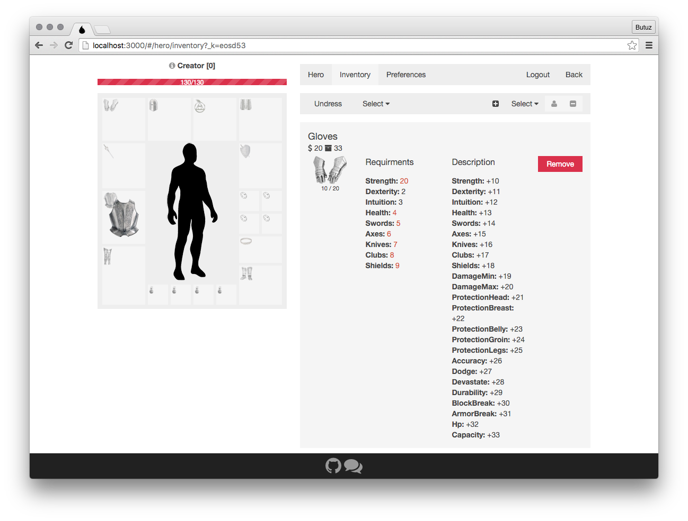
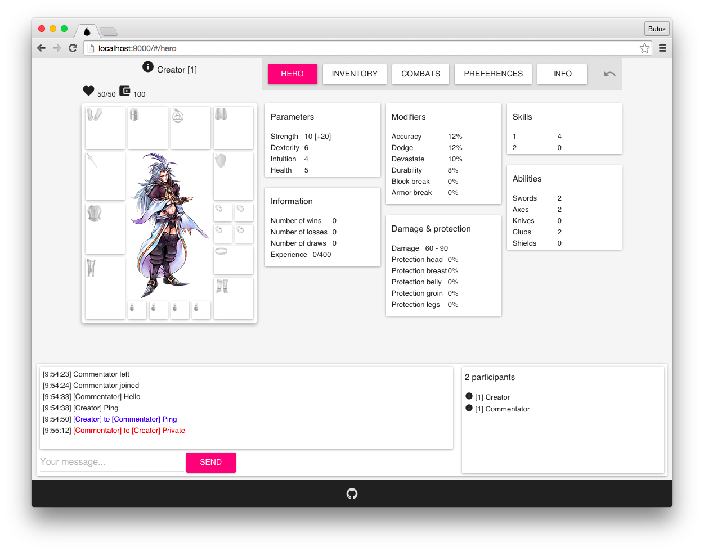

# Game BBMMORPG
[](https://gitter.im/DragonLegend/game?utm_source=badge&utm_medium=badge&utm_campaign=pr-badge&utm_content=badge)
[](https://travis-ci.org/DragonLegend/game)
[](https://dragonlegend.herokuapp.com/)  
Browser based massively multiplayer online role playing game

## Technologies

* [Koa](http://koajs.com/)
* [Mongoose](http://mongoosejs.com/)
* [Socket.io](http://socket.io/)
* [React](http://facebook.github.io/react/)
* [Flux](http://facebook.github.io/flux/)
* [Material-UI](http://material-ui.com/)
* [Gulp](http://gulpjs.com/)

## Dependencies
Mongo  
Node v0.12.x

## Usage

### Quick start
```
npm install  
npm start
```

### Development
```
npm install  
npm run start-dev  

cd public  
npm start
```

## Progress







## License

MIT © [ButuzGOL](https://butuzgol.github.io)
